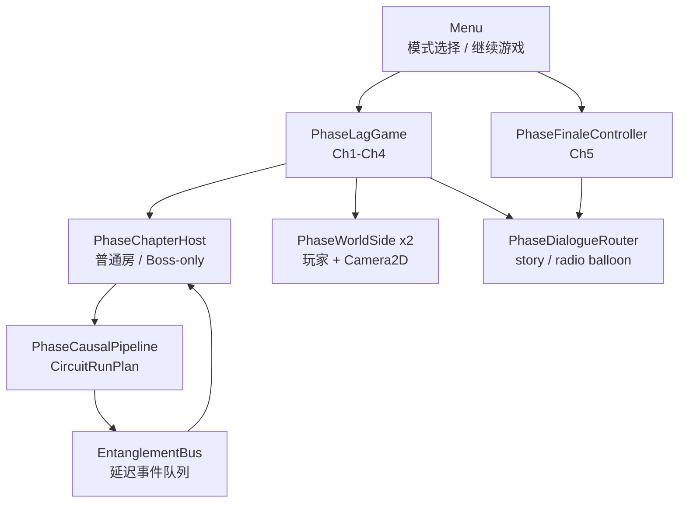

# 《迟相 / Phase Lag》技术合同

本文档只描述当前实现。旧网格墙板、Ch4 普通房、Ch5 谜题房、`has_boss` 和独立 Boss checkpoint 场景均不再属于项目合同。

## 实现原则

- Godot 目标版本为 `4.7.stable.mono`，Phase Lag 玩法使用 GDScript。
- 关卡、实体管线、UI、碰撞、Dialogue balloon 和触发器必须由 `.tscn` / `.tres` 创作。
- 脚本不得运行时创建玩法节点、UI 节点、`Theme`、`StyleBox` 或布局结构。
- 本地状态即时生效；跨时空状态默认经 `EntanglementBus` 延迟 `3s` 抵达。
- 房间复位、失败、离场和 Boss 失败会清空在途事件，不能靠多次失败拼接解法。
- Ch1–Ch3 使用普通房流程，Ch4 只有 Boss 场，Ch5 只有演出。

## 目录职责

| 路径 | 职责 |
| --- | --- |
| `Scenes/PhaseLag/Chapters/` | 五章入口场景。 |
| `Scenes/PhaseLag/Rooms/` | Ch1–Ch3 双侧 authored 房间和 Ch4 Boss 双侧场景。 |
| `Scenes/PhaseLag/Circuit/` | 实体因果管线、固定插槽、导管和 relay 场景。 |
| `Scenes/PhaseLag/Dialogue/` | story/radio balloon、响应按钮和世界触发器。 |
| `Scripts/PhaseLag/Core/` | 章节/房间资源、跨时空事件、总线和模式常量。 |
| `Scripts/PhaseLag/Gameplay/` | 章节编排、玩家、Boss 和 Finale 控制器。 |
| `Scripts/PhaseLag/Rooms/` | authored 房间装载、复位和稳定状态恢复。 |
| `Scripts/PhaseLag/Devices/` | 门、平台、激光、护盾、压力板和蓄能器。 |
| `Scripts/PhaseLag/Enemies/` | 舰载无人机、地行寄生体、设施守卫状态机。 |
| `resources/phase_lag/` | 章节、房间、零件、角色视觉、Theme 和 shader 资源。 |

## 运行时所有权



### `PhaseLagGame`

- 只持有 `chapter_01` 到 `chapter_04`。
- 根据 `flow_kind` 装载普通房章节或 Boss-only 章节。
- 应用分屏布局、房间延迟、输入所有权、失败复位和章节切换。
- Ch2 及其全部房间固定使用上下 `1:1` 分屏。
- 单人角色离场后自动切换，并把 `solo_switch` 锁到下一房间或明确复位。
- 房间完成 link 写入单调的完成印记；反向边沿不能撤销已经成立的目标。
- 通过 `PhaseDialogueRouter.play_story()` 播放章首、房间开场、房间完成和章末对白。
- Ch4 checkpoint 只表示可跳过约 `10–15s` 的不可操作 Boss 入场对白；Boss 战始终从第一阶段干净状态开始。

### `PhaseFinaleController`

- 只持有 `chapter_05`。
- 不创建玩家、不调用 `PhaseChapterHost`，也不包含门、战斗、失败或谜题状态。
- 由 Dialogue Manager、`AnimationPlayer`、镜头和音频推进整段演出。
- 中断后继续游戏从 Finale 开头重播，不保存演出中间状态。

### `PhaseChapterHost`

- `rooms` 章节必须至少有一个普通房，且不能携带 `boss_room`。
- `boss` 章节的 `rooms` 必须为空，且必须提供唯一 `boss_room`。
- `finale` 章节会被拒绝。
- `reset_active_room()` 先清空事件队列，再重建当前双侧房间。
- 稳定存档只捕获 `phase_persistent` 节点已经抵达的状态。

## 数据接口

### `ChapterDefinition`

```gdscript
flow_kind: String # rooms | boss | finale
chapter_id: StringName
chapter_number: int
display_name: String
chapter_scene_path: String
next_scene_path: String
base_delay: float
layout_mode: int
checkpoint_id: StringName
opening_dialogue_title: StringName
completion_dialogue_title: StringName
rooms: Array[PhaseRoomDefinition]
boss_room: PhaseRoomDefinition
```

固定映射：

| 章节 | `flow_kind` | 内容 |
| --- | --- | --- |
| Ch1–Ch3 | `rooms` | 每章三个普通房。 |
| Ch4 | `boss` | `rooms` 为空，只使用 `phase_hunter`。 |
| Ch5 | `finale` | 不交给 `PhaseChapterHost`。 |

### `PhaseRoomDefinition`

房间资源只保存双侧场景、宽度、分屏、检查点、延迟覆盖、完成 links 和 Dialogue title。完成条件必须来自真实设备或事件抵达，不读取 UI 文本。

## 存档与模式

`LevelModule.play_mode` 只接受：

```text
solo
local_coop
```

- 新游戏先进入 authored 模式选择层。
- 继续游戏直接读取已保存模式，不再次询问。
- 旧存档缺少 `play_mode` 时按 `solo` 读取，并在下次保存补齐。
- 局内禁止热加入、退出 P2 或切换模式。
- 双人模式缺少 P2 设备时先等待；断线立即暂停并显示 authored 重连层。
- 单人模式的离场锁只持续当前房间；下一房间载入、失败重建或明确复位时解除。
- 旧 Ch4 普通房 checkpoint 映射到 Boss 开始；旧 Ch5 房间 checkpoint 映射到 Finale 开头。

存档不包含事件队列、玩家即时位置、当前血量、临时敌人状态、Boss 阶段或 Finale 中间帧。

## 实体因果管线

`PhaseCausalPipeline` 是世界中的 authored 设施，不打开 modal，也没有网格选择框。

- 固定插槽、导管、闸刀、输出和零件初始状态都写在房间 `.tscn`。
- 陆衡在 `Breaker/InteractionPoint` 约 `220px` 内按 `J` 进入实体维护焦点；首次按键不同时操作设备。
- 焦点内方向输入沿 `connected_socket_ids` 导航；总闸作为虚拟目标，只连接最近的 enabled 插槽。
- `J` 操作当前插槽或总闸，`K` 旋转手持模块或当前可旋转模块，`L` 退出并保留手持模块。
- 焦点期间角色、房间和设备仍可见，但陆衡停止移动、跳跃和冲刺；焦点外 `L` 仍是冲刺。
- 可移动 `CircuitPart` 常驻弱描边；可拿取为青色、合法放置为绿色、非法目标为低亮橙色，fixed 插槽使用低亮暖灰地标描边。
- `MagneticObject` 保持约 `190px` 的直接近距离交互；普通机关和复位杆约 `180px`，不纳入管线焦点。

`build_run_plan() -> CircuitRunPlan` 继续提供确定性执行：

1. 求值当前 authored 拓扑。
2. 生成不可变的输出开启/关闭边沿。
3. 本地 device relay 按计划即时应用。
4. 跨时空 output 进入 `EntanglementBus`。
5. 房间复位按 `run_id` 清理尚未抵达的事件。

实体延迟模块额外增加 `1s`、`3s` 或 `6s`。`CircuitSourceRelay.required_event_count` 默认 `1`；Ch3 R3 使用 `3`，达到阈值后只触发一次管线脉冲。

## 设备合同

- `PoweredDoor.latch_open`：首次开启后忽略关闭沿；显式房间复位恢复初始状态。
- `PoweredDevice.latch_effective_state`：`-1` 不锁存，`0` 锁存第一次有效关闭，`1` 锁存第一次有效开启；稳定 checkpoint 保存该状态。
- `FacilityGuardPowerReceiver.active_high`：默认 `true`；Ch2 R2 使用 `false`。
- `CircuitSourceRelay.required_event_count`：用于 Ch3 R3 的第三次事件锁存。
- `FacilityGuard.apply_remote_destruction()`：未来对应体在延迟抵达时原地成为具有压力重量的残骸。
- `PhaseCaptureReceiver` 是玩法接收器，不能和已删除的截图 capture harness 混淆。

## Dialogue Manager

- `phase_story.dialogue` 保存章首、章末、房间剧情和 Ch5 二选一。
- `phase_barks.dialogue` 保存世界内短提示。
- `PhaseDialogueRouter` 只选择 story/radio balloon 并防止重入。
- `PhaseDialogueTrigger` 是 authored `Area2D`；玩家进入后调用 `play_story()` 或 `play_bark()`。
- Router 忙时 trigger 等待 `dialogue_finished` 后重试。
- story balloon 暂停游戏并等待推进；radio balloon 不暂停并自动关闭。
- 两类 balloon 均贴近上下分屏中线；story 打字完成后只显示低幅呼吸箭头，不显示“确认 / 继续”。
- 只有 Dialogue Manager 提供真实 `responses` 时才显示响应按钮。
- 章节切换使用 authored `PhaseChapterTransition` 合拢/展开，不使用白闪或运行时 UI 工厂。
- 旧 HUD DialoguePanel、字符串队列和自制 `speaker|text` 解析不再存在。

## UI 合同

- 设置页使用 `resources/phase_lag/ui/phase_settings_theme.tres`。
- CheckButton、HSlider、OptionButton 和 PopupMenu 的状态、字体、边框和图标全部 authored。
- 设置脚本不得创建或覆盖 `StyleBox`。
- 按键行是固定 `PanelContainer` 实例，宽约 `600px`、高 `76px`；动作列 `180px`，列距 `16px`，行距 `12px`，正文 `22px`。
- 鼠标进入行或键位按钮时该行按钮 `grab_focus()`；selected 边框和左侧强调条随鼠标、键盘和手柄移动，并自动滚动到可见区域。
- 常驻键位条和旧管线焦点框已删除；世界交互提示只在靠近目标时出现。
- HUD 只在各自分屏角落显示角色、控制权和生命点，全部 `mouse_filter = IGNORE`；章节名仅在进入与转场时短暂显示。

## 冲刺反馈

- `PhaseDashAfterimage` 是 authored 场景，固定包含两个 `Sprite2D`，不在运行时创建视觉节点。
- 两层残影复制当前角色帧，位于运动反方向约 `24px` / `48px`，以 `0.24` / `0.12` 透明度在约 `0.18s` 内淡出。
- 残影使用普通混合，不发光、不缩放爆闪；低闪烁模式将透明度减半。

## 战斗与失败

- Ansimuz 地行异形过渡图：跳扑寄生体逻辑。
- Ansimuz 舰载机过渡图：飞行追踪、俯冲/接触攻击逻辑。
- Ansimuz Biped：巡逻、近战、冲锋、受击、停机和可压板残骸。
- Ansimuz Tank：Ch4 相位猎手唯一 Boss 本体。
- 普通攻击对未操控角色由自动防御处理；破防攻击只能给出预警，不能在玩家无法控制该角色时直接结算。
- 普通房失败重建当前房间；Boss 失败清空事件并返回菜单，继续游戏从第一阶段开始。

## 验证边界

自动检查只执行：

```powershell
godot --headless --path . --import
godot --headless --path . --editor --quit
```

并短启动主菜单、Ch1 R1、Ch2 R1 和 Ch2 R2。项目不保留 PhaseLag 自动测试、截图比较或 capture harness。

以下内容必须人工游玩：模式选择、旧存档继续、单人切换、完整双人、P2 断线重连、九房解谜、管线拿取与旋转、两类 balloon、Boss 三阶段、死亡复位和完整 Finale。
